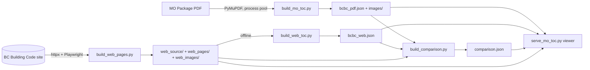

# PDF-vs-Web Comparison Engine: Specification

This spec covers how this repository compares the signed MO Package PDF with the BC Building
Code website:

- turning each into a matching index;
- comparing the two item by item: text, bold/italic, tables, figures and equations.

It is written so the engine can be carried into an existing application and made its core.

- **Status:** as built on `main` at PR #100, 2026-09-28.
- **Result:** 83,548 of 94,166 compared items match (88.7%).
  - Almost every remaining failure is a real difference on the website, not an extraction error.
  - These differences are catalogued with counts in `2026-09-27-site-discrepancies-report.md`.
- **Related designs:**
  - `2026-09-20-mo-toc-viewer-design.md` (the PDF index and viewer)
  - `2026-09-25-web-toc-local-scrape-design.md` (the Playwright snapshot)
  - `2026-09-25-cross-source-unified-numbering-design.md` (the shared keys)
  - `2026-09-26-compare-emphasis-design.md` (the text and bold/italic rule)

Paths are relative to the repository root. `file:function` references point at the code that
implements each rule, so every statement can be checked against the source.

---

## Contents

1. [What the engine does](#1-what-the-engine-does)
2. [Principles that made it reliable](#2-principles-that-made-it-reliable)
3. [Architecture and data flow](#3-architecture-and-data-flow)
4. [The shared key: unified numbering](#4-the-shared-key-unified-numbering)
5. [PDF extraction](#5-pdf-extraction)
6. [Web acquisition with Playwright](#6-web-acquisition-with-playwright)
7. [Web index, built offline](#7-web-index-built-offline)
8. [Text and emphasis comparison](#8-text-and-emphasis-comparison)
9. [Table, row and cell pairing](#9-table-row-and-cell-pairing)
10. [Image comparison](#10-image-comparison)
11. [Failure reasons](#11-failure-reasons)
12. [Output contract: comparison.json](#12-output-contract-comparisonjson)
13. [The viewer](#13-the-viewer)
14. [How a rule change is judged](#14-how-a-rule-change-is-judged)
15. [Results and what is left](#15-results-and-what-is-left)
16. [Carrying the engine into an existing application](#16-carrying-the-engine-into-an-existing-application)
17. [Appendix A: every threshold and constant](#appendix-a-every-threshold-and-constant)
18. [Appendix B: change history by effect](#appendix-b-change-history-by-effect)

---

## 1. What the engine does

It has two inputs:

- **The reference.** The signed PDF, `data/MO Package BCBC MRK signed.pdf`.
  - It has 1,685 pages.
  - It is the marked-up (MRK) edition: revised words are underlined and some figures are framed
    in green.
- **The subject.** The website `https://dev.buildingcode.gov.bc.ca`, version `2024`, content as of
  `2024-03-08`.
  - It is a Next.js app that renders in the browser from content JSON.
  - Its tables lazy-load, and its equations are MathJax.

It produces three JSON files and a viewer:

| File | Producer | What it holds |
|---|---|---|
| `output/bcbc_pdf.json` (+ `output/images/`) | `src/build_mo_toc.py` | The PDF's full hierarchy: Volume down to Subclause, plus Tables, Rows, Cells, Notes and Appendices. Each node has its text and bold/italic, page and bounding box. Also every caption and all 626 images. |
| `output/bcbc_web.json` (+ `output/web_pages/`, `output/web_images/`) | `src/build_web_pages.py` (network), then `src/build_web_toc.py` (offline) | The same hierarchy as the site renders it. Each node has its rendered text, bold/italic, and a `location: {page_file, xpath, bbox}` in a locally saved copy of the site page. |
| `output/comparison.json` | `src/build_comparison.py` | A pass/fail for every numbered PDF node and image, the pairings where the two sides don't line up by number, and a reason for every failure. |
| Viewer at `http://127.0.0.1:8001` | `src/serve_mo_toc.py` | The PDF page and the saved web page side by side, with the clicked item highlighted on both, ✓/✗ on every row, and a "Why it differs" box. |

Only the website snapshot touches the network. Everything else is deterministic, offline and
re-runnable.

## 2. Principles that made it reliable

Each principle below was learnt from a real failure (Appendix B), and together they are why the
result can be trusted. Carry them into the new application as rules, not suggestions.

1. **The PDF is the reference and is never corrected.**
   - When the PDF misprints something, the index keeps it as printed. Examples: two Clauses
     lettered `h)`, Article 10.1.1.1. printed twice, `iii)` repeated.
   - The duplicate gets a `~2` key.
   - The comparison must never "fix" the reference to make the site match.
2. **Every tolerance applies to both sides alike.**
   - An accepted difference is written as characters that don't count, on either side
     (`src/shared/styled_text.py:_UNCOUNTED`). Examples: "a typed `---` is one dash", "a cited
     number's final period doesn't count".
   - It is never a rewrite of one side into the other, so a rule can only ignore, never invent.
3. **Compare exactly, then accept named conventions one at a time.**
   - The base rule is that text must be identical apart from whitespace, and bold/italic must be
     identical on every letter and digit.
   - Each tolerance was added only after its instances were listed, eyeballed and approved.
     The tolerances are: dashes, quotes, dot glyphs, typed dashes, punctuation at closing quotes,
     cited-number periods, bracketed-citation periods and superscript digits.
   - There is no fuzzy "95% similar" text rule, because it would hide real wording changes.
4. **Pair structurally, never by look-alike.**
   - Items pair by their code number.
   - Where the two sides number differently, items pair by title, content or position within the
     same provision. This covers tables in an article, rows, cells and Fig vs Eq labels.
   - Items never pair across provisions, and never because two images happen to look alike.
   - Similarity was once used to choose image partners. It paired look-alike house diagrams from
     different table rows, so it was removed.
5. **Measure the site as it renders, not as its JSON says.**
   - Cross-references (`[REF:…]`), CSS-generated brackets, revision dates and lazy-loaded rows only
     resolve in a browser.
   - The web text that is compared is the text a reader sees.
6. **Freeze the web source, then build offline.**
   - One networked step snapshots everything: navigation, content JSON, rendered pages, assets,
     figures and equation screenshots.
   - Every later step reads only that snapshot, so builds are reproducible and quick to iterate.
     Re-measuring takes about 20 s and a rebuild a few minutes.
7. **Fail loudly on incomplete input.**
   - A table that stays short after lazy-load scrolling makes the scrape exit non-zero.
   - A table whose rendered row count differs from its JSON stops the build (`GridMismatch`).
   - Silent truncation is how the first scrape kept only 121 of 5,949 rows.
8. **Every failure explains itself.**
   - A failed item carries the differing stretch, with 30 characters of context either side.
   - It also carries its kind: wording, reference wording, standard designation, punctuation,
     letter case, bold/italic, or missing. A reviewer never has to hunt.
9. **Judge each rule change on a labelled set and a full rebuild.**
   - A change is accepted only if it adds true matches without adding any on the
     known-different set.
   - The full per-table comparison must also show no losses (section 14).

## 3. Architecture and data flow



### Packages

- The code follows Clean Architecture: each library is split into `domain/`, `parsing/` and
  `output/`.
- PDF-library, HTTP and browser details sit behind small interfaces, so the rules can be
  unit-tested with fakes.

| Package | Responsibility |
|---|---|
| `src/mo_toc/` | The PDF index. `pdf_source.py` wraps PyMuPDF (`PdfSource` interface). `tree_builder.py`, `heading_rules.py`, `body_segmenter.py`, `marker_rules.py`, `table_extractor.py`, `image_extractor.py`, `vector_cluster.py`, `image_matcher.py` and `notes_nesting.py` build the tree. `web/` holds the viewer. |
| `src/web_toc/` | The web index. `site_source.py` uses httpx and `page_source.py` uses Playwright. `page_html.py`, `layout_script.py` and `equation_script.py` hold the JS run in the page. Then `layout_join.py`, and extractors for tables, body, Appendix D, notes and images. |
| `src/shared/` | Pure helpers used by both sides. `numbering.py` builds the unified keys. `styled_text.py` holds text plus bold/italic ranges, and the comparison signature. |
| `src/comparison/` | The engine. `engine.py` walks the tree and pairs tables. Also `row_alignment.py`, `content_match.py`, `image_pairing.py`, `image_similarity.py`, `equation_text.py`, `formula_ocr.py`, `difference.py`, `reasons.py` and `asset_loader.py`. |
| `src/image_compare/` | Image metrics: `phash.py`, `autocrop.py`, `ink_hash.py`, `similarity.py` and `ink_correlation.py`. |
| `src/equation_export/` | A standalone LaTeX/MathJax renderer for the site's equation map. It is not on the comparison path. |

### Runtime dependencies

- `pymupdf`, `Pillow`, `imagehash`, `numpy`, `httpx`
- `playwright` (Chromium)
- `fastapi` and `uvicorn`, for the viewer
- Tesseract is optional (`brew install tesseract`). Without it, equations are compared by pixels
  alone.

### Build commands

Snapshot the site. This needs the network, takes minutes, and exits 1 if a table stays short:

```bash
python src/build_web_pages.py
```

Re-measure the saved pages, offline (about 20 s):

```bash
python src/build_web_pages.py --measure-only
```

Build `bcbc_web.json`, offline:

```bash
python src/build_web_toc.py
```

Build `bcbc_pdf.json` and `images/` (process pool, about 1–2 min):

```bash
python src/build_mo_toc.py
```

Build `comparison.json` (a few minutes):

```bash
python src/build_comparison.py
```

Start the viewer on 127.0.0.1:8001:

```bash
python src/serve_mo_toc.py
```

Every script accepts `--output-dir`. That is how a change is measured in a scratch directory
against a baseline, without touching the shared `output/` (section 14).

## 4. The shared key: unified numbering

- Both indexes give a node the same `unified_number` when it is the same provision, and the
  comparison joins on that key.
- Getting the key identical on both sides is the foundation. Most early failures were key
  mismatches, not content differences.

### Algorithm (`src/shared/numbering.py:assign_unified_numbers`)

Each node type has a rule of one of these kinds:

| Kind | Key built as | Example |
|---|---|---|
| `fixed` | a literal prefix | `V1`, `FM`, `BM` |
| `root` | prefix + identifier; restarts the chain | `B`, `AppD` |
| `absolute` | nearest root key + `.` + identifier | `B.9.23.13.7`, `A.A-1.1.1.1.(3)`, `AppD.D-1.1.1` |
| `child` | parent key + `.` + identifier | `B.9.23.13.7.(1)` |
| `suffix` | parent key + identifier, no dot | `B.9.23.13.7.(1)(a)(i)` |
| `literal` | parent key + `.` + prefix | `A.1.Notes` |
| `ordinal` | scope or parent key + `.` + prefix + n | `B.9.Spec1`, `…Tbl4`, `…Tbl1.Row3.Col2`, `…Fig2`, `…Eq1` |

- **Identifiers** are normalised: whitespace is collapsed and the trailing `.` dropped. So Article
  `9.23.13.7.` becomes `B.9.23.13.7`.
- **Scopes.** Tables, figures and equations are counted per scope. The scopes are Part, Section,
  Subsection, Article, Notes, Note and TableGroup. So a table inside a Clause is still
  `<Article>.TblN`.
- **Page order.** On the PDF side, scoped ordinals are numbered in page order
  (`position = (page, y0)`), not tree-walk order. Otherwise tables placed under a clause were
  counted ahead of their siblings.
- **Duplicates.** A repeated key gets `~2`, `~3` and so on.
  - `fixed` and `root` keys are exempt.
  - This is because the site splits Division B across two volumes, and both halves must stay `B`.
- **Two rule sets.**
  - `src/mo_toc/parsing/numbering_config.py` (PDF) and `src/web_toc/parsing/numbering_config.py`
    (web) map each side's node types onto the same kinds.
  - For example, PDF `Article` and web `article` are both `absolute`. `NotesContainer` and
    `part_appendix` are both `literal "Notes"`.
  - The Volume never enters a key, so the site's Volume 2 Part 9 still yields `B.9…`.
- **Labels, not citations.**
  - Appendix D's list items have no ids on the site, so they are *cited* by position:
    `<para>.li2`, `<para>.li2.li1`.
  - They are given identifiers `(b)` and `(i)`, so their *keys* are `…(1)(b)(i)`, exactly as in
    the PDF.

**Lesson:** key on the code's own official numbering, never on position in the tree.

- Position numbering broke whenever either side had an extra wrapper or a missing level.
- The earlier positional design (`2026-09-21-unified-numbering-design.md`) was replaced for that
  reason.

## 5. PDF extraction

### 5.1 Reading pages (`src/mo_toc/parsing/pdf_source.py`, `parallel_extraction.py`)

- **Library:** PyMuPDF only, behind the `PdfSource` interface.
- **Text:**
  - Read with `page.get_text("dict")` as blocks, lines and spans.
  - Whitespace-only spans are dropped, and lines are sorted by `(y0, x0)`.
  - Each `PageLine` keeps:
    - its `bbox`, `text` and font name(s);
    - its `emphasis` ranges;
    - `centred`: the line's midpoint is within 20 pt of the page centre;
    - per-span `runs` `(start, end, x0, x1)`, used to split a line at column rules and to detect
      glued markers.
- **Emphasis** is taken per span (`_span_style`), as style `b`, `i` or `bi`:
  - bold: flag 16, or a font name containing Bold, Black, Heavy, Semibold or Demi;
  - italic: flag 2, or a font name containing Italic or Oblique.
- **Drawings:**
  - `page_drawing_rects` returns every colour and is used for vector figures.
  - `page_rule_rects` returns neutral colours only (RGB spread ≤ 0.05) and is used for table rules.
    This is because blue cross-reference underlines had created bogus table rows.
- **Images:** read with `get_image_info(xrefs=True)`. The transform gives `flipped_x`/`flipped_y`
  (negative a or d).
- **Parallelism:**
  - A `ProcessPoolExecutor` runs one worker per CPU.
  - Each worker opens the PDF once, in its initializer, because reopening per page costs about
    45 ms.
  - The job is CPU-bound, so threads don't help.
  - Each page returns its lines, raster and vector images, table regions and rule rects.
  - Tree assembly then runs sequentially in the main process.

### 5.2 Building the tree (`tree_builder.py`, `heading_rules.py`)

**Headings** are recognised by a regex plus a required font:

| Node | Pattern (abridged) | Font |
|---|---|---|
| Division | `^Division\s+([A-Z])$` | Arial-Black |
| Part | `^Part\s+(\d+)$` | Black |
| NotesContainer | `^Notes to Part\s+(\d+)$` | Black |
| Section | `^Section\s+(\d+\.\d+)\.\s*(.*)$` | Black |
| Article | `^(\d+\.\d+\.\d+\.\d+)\.\s*(.*)$` (`\s*` because "3.2.2.64.Group D" has no space) | Black |
| Subsection | `^(\d+\.\d+\.\d+)\.\s+(.*)$` | Black |
| Appendix, AppendixPart/Section/Article | `^Appendix\s+([A-Z])$`, `^Section\s+([A-Z])-(\d+)…`, `^([A-Z])-(\d+\.\d+(\.\d+)?)\.…` | Black |
| TableGroup | `^[A-Z][A-Za-z ]*\bTables$` | Black |
| BackMatter | `^PROVINCE OF BRITISH COLUMBIA$`, only after structure has been seen | Bold |

**Nesting.** A rank stack works like implicit closing tags: a new node closes every open node of
rank ≥ its own.

**Titles.**

- A heading's title folds in the following Black-font lines, because "Part 1" and "Compliance" are
  separate blocks.
- A title ending in "and" or "or" still folds in a heading-shaped line.

**Per-line order** (`_process_page`):

1. Skip lines consumed by a table.
2. Skip the page's trailing page number: a bare `^\d+$` last line, which otherwise lands
   mid-sentence.
3. Caption.
4. Heading.
5. Note line, inside Notes.
6. Body line, skipping table-notes blocks.

**Misset Article headings** (`_misset_article_heading`):

- Three Articles print their heading in the body font: 9.4.2.2., 9.10.9.19. and 9.10.16.3.
- A body line matching the Article pattern is taken as the next Article only when all three hold:
  - its number is exactly the open Article's number + 1;
  - its title starts with an uppercase letter;
  - its title does not end in ".".

### 5.3 Sentences, clauses and subclauses (`body_segmenter.py`, `marker_rules.py`)

**Markers** match `^([A-Za-z0-9]{1,4})\)\s+(.*)$`:

- digits → a Sentence;
- a letter → a Clause;
- a roman numeral from 1 to 60 → a Subclause;
- the single letters i, v, x, l, c, d and m are ambiguous.

**Glued markers.** These are lines like "3)For the purpose…", where the space was a dropped
whitespace span.

- They are accepted only when the line's first span ends exactly at the `)`.
- That rule rejects things like "side)" in table cells (`match_marker`).

**Ambiguous letters** are resolved by the first rule that applies (`_resolve_kind`):

1. **Roman run:** the token is the current clause's next subclause numeral, *and* the next marker
   is the numeral after it. This means a subclause, and handles "h) … i) … ii) …".
2. **Next clause letter:** the token is the next expected clause letter, so a clause.
3. **Next subclause numeral:** the token is the next subclause numeral, so a subclause.
4. **Indent:** whether the marker is left or right of the midpoint between this sentence's median
   clause-marker x0 and median subclause-marker x0.
5. **Proximity:** more than 8 pt right of the previous clause means a subclause.

**The "(See …)" tail.** A line starting `(See` at the sentence's indent goes to the Sentence, not
its last clause. This fixed 245 items.

**Also:**

- Text before `1)` is discarded.
- An Appendix article with no numbered paragraph keeps its whole body as `content`.
- A node's bbox is its first line plus its continuation lines on the same page.

### 5.4 Notes to Part

**Opening a Note.** Inside a NotesContainer, a line opens a Note when it matches the note-number
shape. The pattern handles:

- "A-3.8.2.3.(5) and (6) and 3.8.3.22.(1)";
- "A-3.1.6.4.(3) to (6)";
- "A-Table 4.1.8.5.-A";
- a title glued on with no space.

**The identifier** is read by its shape, not "up to the first space".

**The content** is the body *after* the run-in title (which ends at `\.(?=\s|[A-Z]|$)`), because
the site shows the heading separately.

**Figure captions.** A Figure caption met inside a Note is kept in the Note's text, because the site
keeps it inline.

**Placement.** `nest_notes_under_parts` moves each NotesContainer under its Part, as the Part's last
child.

### 5.5 Tables (`table_extractor.py`, the largest module)

A table is found from its caption, never by scanning for grids, because a blind scan finds every
box on the page. Each heuristic below fixed a measured failure:

1. **Anchor.** Detection starts from a bold "Table …" caption, or from a centred plain-font caption
   that is only the identifier (20 of these).
2. **Rules.** Horizontal and vertical rects ≤ 2 pt thick, in a neutral colour only. Boundaries
   within 2 pt are merged.
3. **MRK underlines are not row rules** (`_is_row_rule`).
   - A horizontal rule is a row boundary only if both ends reach a column rule or the grid edge.
   - Revision underlines start and stop inside a cell.
4. **Grid band.** The grid runs from below the caption to the next Table caption on the page.
   Before this rule, stacked tables swallowed each other.
5. **Lines to cells.**
   - The row is chosen by the line's vertical centre.
   - The column is chosen by where the line *starts*, because spanning headings belong to their
     first column.
6. **Split at column rules.**
   - A line crossed at mid-height by an inner vertical rule is split at that rule.
   - Word positions are interpolated across each span's characters (e.g. "46 91",
     "1.2 1.5 2.0").
7. **Row spans.**
   - Where the row rules at a boundary cover less than half a column, the text moves to the span's
     first row and the other rows are left empty.
   - This matches how the site lists a spanning cell.
8. **Title and "Forming part of".** Read from up to 3 caption-font lines, and consumed so they never
   become body text.
9. **Header-only page.** A caption page that fits only the header still starts the table (a minimum
   of 1 row).
10. **Orphaned caption.** A caption at the foot of a page takes the grid at the top of the next page
    (16 tables).
11. **Continuation without a caption.**
    - The next page's grid continues the pending table when both hold:
      - its x-range matches within 2 pt;
      - its columns carry on: the same count, or only a bold header so far, or every previous
        column rule reappearing as a full-height rule.
    - It is refused when any of these holds:
      - a "Forming part of" line sits above the grid;
      - a caption-font title block sits above the grid;
      - the previous page left a caption unfilled.
    - "Has a bottom border" is ignored, because the PDF redraws a closed box on every page.
12. **Tail above the next caption.** On a page with its own caption, the rows above that caption are
    tried as the previous table's continuation (about 300 rows).
13. **Row split by a page break.**
    - A continuation's first row is joined back into the previous row when it has exactly one filled
      cell, not the first, in a column the previous row also filled.
    - This applied to 52 rows, and 47 were confirmed against the site.
14. **Owner.** Tried in order:
    1. `<division>-<table id>` as a citation;
    2. the "Forming part of" reference;
    3. position.
15. **Vector crops over tables are dropped, raster images kept.** Dropping the rasters too lost 154
    real images.

### 5.6 Images (`image_extractor.py`, `vector_cluster.py`, `image_matcher.py`)

- **Rasters.**
  - Every embedded image is kept, with no size filter.
  - An image drawn flipped is flipped back (`_as_drawn`, which also converts CMYK to RGB), so it is
    saved and hashed as a reader sees it. This affects the six A-9.32.3.4 figures.
- **Vector figures.**
  - Drawing rects within 5 pt of each other are clustered.
  - A cluster is dropped if any of these holds:
    - it covers less than 400 pt²;
    - it overlaps a raster or a table;
    - its rects form a grid.
  - Each surviving cluster is rendered at zoom 3 to PNG.
- **Owner.** The deepest node whose `(page, y0)` precedes the image. Tables, Rows and Cells are never
  owners.
- **Caption.**
  - It must be on the same page, within 50 pt.
  - Only images at least 40 pt on their short side get a caption.
  - Figure captions win over Table captions, then the nearest caption wins.
- **Decorative.** Aspect ratio ≤ 2 and area < 1,600 pt². Decorative images are not numbered.
- **Equation or figure** (`image_classification.py`). An image is an equation when all hold:
  - it has no caption and is not decorative;
  - it is not over a table;
  - width > height, height ≤ 70 pt, and aspect ratio ≥ 2.
- **Why 70 pt.** The tallest formula is 60 pt and the shortest wide diagram is 72 pt.
- **Numbering.** Equations are numbered `EqN` and figures `FigN`, counted separately per scope.

### 5.7 PDF node shape

```json
{"type": "Clause", "identifier": "(a)", "citation": "A-1.1.1.1.(1)(a)",
 "page": 7, "end_page": 12,
 "bbox": {"x0": 108.6, "y0": 227.59, "x1": 324.09, "y1": 241.06},
 "unified_number": "A.1.1.1.1.(1)(a)",
 "content": "the design and construction of a new building,",
 "emphasis": [[37, 45, "i"]], "children": []}
```

- `bbox` is in PDF points, from the page's top-left corner.
- Only Sentence, Clause, Subclause, Cell, Note and AppendixArticle carry `content`/`emphasis`. A
  container's text is its children's.
- Heading nodes carry `heading`, the literal words, e.g. `Part 1`, `9.23.13.7.`.
- An image entry looks like this:

```json
{"page": 513, "bbox": {…}, "width": 377, "height": 393,
 "phash": "edc934cc922a4bb6", "image_path": "images/img_100.png",
 "owner_citation": "B-4.1.7.4.(2)", "caption_kind": null, "title": "",
 "decorative": false, "unified_number": "B.4.1.7.4.Fig1"}
```

## 6. Web acquisition with Playwright

`src/build_web_pages.py` is the only networked step. It runs these stages in order:

1. Navigation tree.
2. Snapshot record.
3. Content JSON cache.
4. Revision resolution.
5. Page rendering.
6. Saving pages.
7. Asset mirror.
8. Figure download.
9. Navigation CSS.
10. `pages.json`.
11. Equation capture.
12. Layout measurement.

### 6.1 Site data (`web_toc/parsing/site_source.py`, `content_url.py`, `output/source_cache.py`)

- **Client:** one shared `httpx.AsyncClient(timeout=30)`.
- **Navigation:** `GET /data/2024/navigation-tree.json`.
- **Content JSON:** one file per section, part appendix, division appendix, spec table or
  front-matter article:
  - `/data/2024/content/<div-slug>/part-N/section-M.json`
  - `…/part-N/appendix.json`
  - `…/appendix-<l>.json`
  - `…/part-N/spectables-K.json`
    - This form is hyphenated. The slash form isn't served, and all 21 spanned tables were missing
      until this was found.
- **Pitfall:** unknown `/data/…` paths return **HTTP 200 with an HTML page**. A response counts as
  valid only if its body starts with `{`.
- **Cache:**
  - Contents are cached 8 at a time, to `output/web_source/content/<citation>.json`.
  - `snapshot.json` records `{"version": "2024", "date": "2024-03-08"}`.
- **Revisions:**
  - The content JSON carries dated `revisions`.
  - `revisions.py:resolve_revisions` keeps, for each revised item, the latest entry on or before the
    snapshot date.
  - It drops the item when that entry is `deleted`, when nothing is in effect yet, or when the entry
    is an empty "original" placeholder.
  - The page render uses the same date, so the JSON and the page agree.

### 6.2 Rendering (`web_toc/parsing/page_source.py:PlaywrightPageSource`)

**Browser.**

- Headless Chromium, with one context and a 1500×950 viewport (the desktop layout).
- 6 tabs at a time (`PAGE_FETCH_CONCURRENCY`). Each tab runs the site's full JS, so more tabs don't
  help.

**Which pages** (`page_targets.py`): about 136 in all.

- Rendered: parts, sections, part and division appendices, spec tables, index, conversions and
  front-matter articles.
- Subsection and article views are *not* scraped. On the site they are the section page cut down,
  so the viewer derives them from the section page.
- Volume and division URLs render the homepage or return 403.

**URL:** `{base}{path}?version=2024&date=2024-03-08`.

**Ready:** `goto(wait_until="networkidle")`, then wait for
`main.ui-ContentPanel .reading-view__content, main.ui-ContentPanel .partRenderer`.

**Lazy-loaded tables.** The site renders long tables 120 rows at a time. Table 9.38.1.1.(1) has
5,949 rows, and the first scrape silently kept 121.

- The expected count per table comes from the revision-resolved JSON: header rows plus body rows.
- The page's count comes from `GRID_ROWS_JS`:
  - it counts a wide table's split header and body tables as one grid;
  - it skips the pinned-column copy.
- The loop:
  1. Scroll row `len-10` into view, then the last row. Jumping back makes the last row re-enter the
     viewport, which triggers the next batch.
  2. Wait with `wait_for_function(grew, 10 s)`.
  3. Stop after three consecutive stalls.
  4. Retry an incomplete page once, in a fresh tab.
- `main()` prints `INCOMPLETE <citation>: {table: [rendered, expected]}` and exits 1.

**Capture:** the `main.ui-ContentPanel` outerHTML, the page title, stylesheet hrefs and inline
styles.

### 6.3 Saving a self-contained page (`page_html.py`, `page_writer.py`, `site_css.py`)

**Cleaning** is pure regex:

- drop the PDF-download header and the `react-aria` ids;
- re-point root-relative `src="/…"` to `/web-assets/…`;
- de-duplicate the info-icon SVG (repeated 1,000+ times) into one `<symbol>` plus a `<use>` in each
  place.

**Shell.**

- The panel is wrapped as
  `<html><head>…</head><body><main><div class="MainLayout…">{panel}</div></main></body>`.
- This fixes the panel's xpath at `/html/body/main/div/main`.
- The only CSS override is `:root{--header-height-full:0px}`, because the saved page has no site
  header.

**Assets** are mirrored into `web_pages/assets/<site path>`:

1. stylesheets, panel images and inline-style `url()`s;
2. whatever those stylesheets reference (fonts).

`site-nav.css` is extracted from the CSSOM: the nav-tree and breadcrumb rules, plus `:root` and
`@font-face`.

**Figures** download to `web_images/<figure id>.jpg`.

### 6.4 Equations (`equation_script.py`)

MathJax draws glyphs as CSS `::before` content. Reading the text therefore doubles every formula,
and the glyphs can't be compared as text. Each equation is turned into an image instead:

- **Serving.** The saved pages are served from a local `ThreadingHTTPServer` on an ephemeral port
  (`local_page_server.py`), at 2× device scale, after `document.fonts.ready`.
- **Keys.**
  - Each `.equation-block` gets the key `<nearest ancestor id>.<data-node-id>`, with `-n` added on
    repeats.
  - The owner is needed because the site reuses one node id for the same formula in several places.
  - Pinned-column copies reuse their original's key.
- **Screenshots.** `mjx-math` is screenshotted once per key, to both
  `web_images/equations/<key>.png` and `web_pages/assets/equations/<key>.png`.
- **Swap.**
  - Each `mjx-container` is replaced with an `` of the same box.
  - Its `alt` is the MathJax `aria-label`, i.e. the site's formula text.
  - The page is then saved again.
- **Result:** 133 of 133 captured.

### 6.5 Layout measurement (`layout_script.py:LAYOUT_JS`)

This runs on each saved page, after `document.fonts.ready`. Measured in the fallback font, text
wraps differently and every bbox below drifts.

**Root:** `/html/body/main/div/main`, which must resolve to exactly one `main.ui-ContentPanel`.

**`xpath`:** absolute and positional (`tag[n]` per level), from the root.

**`bbox`:**

- in CSS px from the panel's top-left, rounded to 0.01;
- every ancestor's scroll offset is added back, because the panel is the scroll container.

**`text` + `emphasis`** come from a custom DOM walk, not `innerText`:

- it includes `::before`/`::after` content (the site draws `[ … ]` around compound references that
  way);
- it pads block boxes with spaces;
- it skips `display:none` and SVG;
- it collapses whitespace;
- bold means computed weight ≥ 600, italic means a non-normal style.

**Output:** `web_pages/<citation>.layout.json`, with:

- `elements`: every `[id]`;
- `lists`: the un-id'd `ol > li` items (Appendix D clauses), recursively;
- `tables`: rows and cells in grid order;
- `images`;
- `equations`;
- `headings`: h1–h6 (headings have no ids).

`--measure-only` re-runs just this step, offline, over the saved pages (about 20 s).

## 7. Web index, built offline

`src/build_web_toc.py` reads only `web_source/` and `web_pages/` (`local_source.py`). If files are
missing, the build stops with a message to run the scrape first.

### 7.1 Structure

**Tree.** Built from the navigation.

- Division identifiers come from "Division X".
- `heading` holds the literal leading heading words.

**Order of attachment:**

1. Notes, so a note's tables and figures resolve to the Note.
2. Appendix D's structure.
3. Images, tables and sentences. Each is owned by stripping trailing dot-segments of its id until a
   citation matches (`owner_resolution.py`).
4. Unified numbers.

**Tables** (`table_extractor.py`):

- The JSON lists only the cells that start in a row, so later cells shift left.
- Empty placeholder cells are therefore inserted at every position a colspan or rowspan covers.
  - 197 of 200 spanned tables become rectangular.
  - This added 7,578 matches.
- A table's row count = header rows + body rows.

**Clauses** (`body_extractor.py`):

- Clauses are lettered `(a), (b)…` by their position in the JSON, **not** by the JSON's `letter`.
- The JSON letter goes stale when BC amendments insert clauses. B.3.8.3.16.(1) reads h, a, i, b …,
  and 45 sentences are affected.
- Subclause numbers are kept as given, because their gaps also exist in the PDF.

**Appendix D** (`appendix_extractor.py`):

- The site's navigation stops at Appendix D, so its sections, subsections and articles come from
  the content JSON.
- They are numbered from the digits in their ids (`D-1.1.3`).
- Paragraphs matching `^\d+\)` become Sentences.
- Each `[LIST:…]` placeholder consumes the next list, recursively:
  - its items become Clauses (`<para>.liN`);
  - their nested items become Subclauses (`<para>.liN.liM`).
- `variable` lists render as `<dl>` and give no clauses.

**Notes** (`note_extractor.py`) are built from `application_note` entries, with identifier
`A-<number>`.

### 7.2 Joining the layout (`layout_join.py:join_layout`)

A node's page is its nearest ancestor-or-self that was scraped. That is how subsection and article
views get locations on the section page.

**Finding the layout entry**, in order:

1. `elements[citation]`.
2. A list-item path `<id>(.liN)+`.
3. A heading match `^(?:Section\s+)?{heading}(?!\d|\.\d)`. The guard stops `1.1` matching `1.10`.

**Rendered text.** For Cells, Sentences, Clauses, Subclauses, Notes and Appendix articles, the
rendered `text` and `emphasis` **replace** the JSON content. This resolves `[REF:…]` tokens into
what a reader sees.

**Tables** (`_place_grid`):

- The rendered row count must equal the JSON's, or the build fails.
- Cells pair by position.
- If the cell counts differ, empty JSON cells are skipped, but only when every non-empty cell still
  pairs.

**Images** (`_place_image`):

- Placed by `src` on the owner's page.
- The n-th image with a given `src` takes the n-th place that `src` is drawn. Otherwise
  9.23.13.7.'s 90 repeated house diagrams all sat on the first copy.

**Figures with no id** (`image_extractor.py`):

- Named `<nearest holder id>.figureN`, in document order.
- 137 figures: Spec Table 1 wall drawings, Appendix D, and Part 9 notes.

**Local files:** the downloaded file, else the mirrored asset copy (`web_pages/assets/<src>.jpg`).

**Equations** become images:

- with `kind: "equation"`;
- numbered `…EqN`, separately from figures;
- with `alt_text` holding the site's formula text.

**Coverage.** `location_report` prints located and unlocated counts per type. Last full run:

| Type | Located |
|---|---|
| Rows, tables, figures, notes, clauses, subclauses | 100% |
| Cells | 49,158 of 49,225 |
| Sentences | 5,057 of 5,058 |
| Equations | 133 of 133 |

### 7.3 Web node shape

```json
{"type": "Clause", "identifier": "(a)",
 "citation": "nbc.divA.part1.sect1.subsect1.art1.sent1.clause1",
 "title": "", "path": "", "children": [],
 "unified_number": "A.1.1.1.1.(1)(a)",
 "content": "a) the design and construction of a new building,",
 "emphasis": [[40, 48, "i"]],
 "location": {"page_file": "web_pages/nbc.divA.part1.sect1.html",
   "xpath": "/html/body/main/div/main/div[1]/…/div[2]/div[1]",
   "bbox": {"x0": 80, "y0": 256.23, "x1": 1444, "y1": 291.25}}}
```

Web images are `{id, src, alt_text, owner_citation, local_path, unified_number, location, kind}`.

## 8. Text and emphasis comparison

### 8.1 What is compared (`comparison/engine.py:compare_trees`)

**Join.**

- Web nodes are indexed by `unified_number`.
- A PDF node looks up `counterparts.get(n, n)`: its re-paired partner if there is one (section 9),
  otherwise the same number.
- A `null` counterpart means "no partner" and fails.

**Leaves only.** Only PDF **leaves** are text-compared: Cells, Sentences, Clauses, Subclauses, Notes
and Appendix articles. Container text is never compared, because:

- a container's web `content` concatenates its descendants;
- the PDF's holds only its own words.

**Roll-up.**

- A node passes when all three hold: its own text passes (leaves only), all its owned images pass,
  and all its children pass.
- Children are evaluated eagerly, so every item gets its own status.

**Stripped from the web side before comparing:**

- a Sentence's, Clause's or Subclause's own leading marker (`1)`, `a)`, `ii)`), only when it equals
  the node's identifier;
- a Note's heading (`identifier title`);
- an Appendix article's heading (`identifier. title`).

The PDF pipeline already separates these, so nothing is stripped on the PDF side.

### 8.2 The signature (`src/shared/styled_text.py`)

Two texts match when their **signatures** are equal. A signature is the list of
`(character, style)` over the compared positions. It is built by five rules.

**1. Whitespace never counts.** It is removed, not collapsed. This absorbs the PDF's line breaks
inside words and citations ("fire- resistance", "A- 1.1.1.1.").

**2. Dot glyphs never count** (`_DOTS = "•·⋅"`):

- the PDF prints list bullets as text;
- it prints "kWh/(m²•year)" where the site has "·".

**3. Characters read as their plain form** (`_PLAIN_CHARACTERS`):

- `“ ” „` → `"`
- `‘ ’ ‚` → `'`
- `‐ ‑ ‒ – — −` → `-`
- `¹ ² ³` → `1 2 3`

**4. Uncounted characters** (`_UNCOUNTED`). Each pattern's **group 1** is dropped. The rest of the
match is context that still counts. The patterns run on both texts:

| Convention | Pattern | Drops |
|---|---|---|
| Typed dash | `-(-{1,2})` | the extra hyphens of `--`/`---`, so they read as one dash |
| Comma/period before a closing quote | `(?<=[^\s“"])([.,])(?=\s*”\|")` | the `,`/`.` in `“preservation,”` |
| Comma/period after a closing quote | `(?:”\|(?<=\S)")([.,])` | the `.` in `Systems".` |
| A cited number's final period | `CITED(\.)(?![\d(])` | the last `.` of `3.2.4.8.` |
| A detached final period | `CITED\s+(\.)(?!\d)` | the ` .` in `Subsection 9.10.9 . 2 h` |

`CITED` is `_CITED_NUMBER`:

```
(?:(?<![A-Za-z])[A-Z]-\d+(?:\.\d+)*|\d+(?:\.\d+)+)(?:\.?\([0-9a-z]+\)(?:\s*\([0-9a-z]+\))*)?
```

- It matches dotted numbers ("3.2.4.8") and lettered numbers ("D-6", "A-9.36.2.4").
- Either can have optional bracket groups, even spaced apart ("D-2.3.9.(2)", "A-2.2.7.2.(1) (b)").
- The guards `(?![\d(])` and `(?!\d)` keep a period that sits *inside* a number because of the
  PDF's line breaks ("3.2 .4.9."), or before a Sentence's "(".
- A bare "(2)" with no number is not a citation, so its period still counts.

**5. Style counts only on letters and digits.**

- Each compared alphanumeric character carries its style: `""`, `b`, `i` or `bi`.
- Punctuation carries none.
- So bold/italic must agree on every letter and digit. No other formatting is compared (font, size,
  colour, layout).

**A known consequence.** The rule is symmetric, so a period after a citation that ends a sentence
("…Article 3.2.4.8.") is uncounted on both sides. If the site dropped that period, it would go
undetected. This was accepted when the rule was approved.

### 8.3 Emphasis capture on each side

- **PDF:** the font name or PyMuPDF flags, per span (§5.1).
- **Web:** computed `font-weight ≥ 600` and `font-style`, per text node, including generated content
  (§6.5).
- **Storage:** both sides store `[[start, end, "b"|"i"|"bi"], …]` ranges into `content`. Unstyled
  text has no range.
- **Alignment:** `StyledText` keeps text and ranges together through join, slice and strip, so
  dropping a marker never misaligns the styles.

## 9. Table, row and cell pairing

Numbering pairs most items, but tables break it: the two sides order and split tables, rows and
cells differently. All of this lives in `comparison/engine.py` and `row_alignment.py`, and the
results go into `counterparts`.

### 1. Tables within their article or note, by title (`table_pairs`)

- **Title key:** drop "Forming part of …" and footnote markers, keep only word characters, and
  lowercase.
- **Alignment** uses `SequenceMatcher(autojunk=False)` on the keys:
  - `equal` blocks pair;
  - `replace` blocks pair by position;
  - inserts and deletes stay unpaired.
- An untitled table never pairs by title.
- A PDF table left unpaired maps itself and all its descendants to `null`. That way it can't be
  compared by accident with a same-numbered stranger.

### 2. Leftovers across articles (`_leftovers_by_title`)

- A table still unpaired pairs with a leftover anywhere whose title key no other leftover shares.
- This covers the Section 3.9/3.10 swap and A-Table 9.23.3.5.-C (+6,260).

### 3. Rows by content (`_row_pairs`)

- Each row's key is the `|`-joined signature of its cells, and rows are aligned with
  `SequenceMatcher`.
- In a `replace` block:
  - **Equal counts:** rows pair by position. Similarity pairing there cost 49 cells in Table
    3.1.8.17.
  - **Unequal counts:** a dynamic program over Jaccard word-set similarity maximises the total
    similarity, in order.
    - It pairs only rows with similarity ≥ 0.5.
    - The rows between those anchors pair by position.
    - The threshold barely matters: anything from 0.4 to 0.7 moved results by about 50 out of
      66,000.

### 4. Cells by content (`_cell_counterparts`)

- The same alignment is used within a paired row.
- An empty cell gets a unique key, so two empties never "match" and drag the row out of line.
- This handles two site behaviours:
  - it lists only the cells a row *starts*;
  - colspan text can sit in a different column on each side.

### 5. An empty PDF cell with no web partner, in a paired row, passes (`_span_covered`)

- The site covers that position with a span, and the PDF shows nothing there either.

## 10. Image comparison

### 10.1 Which images pair

**Default: by `unified_number`.** A PDF `…Fig2` compares with the web `…Fig2` of the same provision,
or with its `counterparts` partner.

**Re-pairing within a provision** (`comparison/image_pairing.py:image_counterparts`).

- When both of these hold, a provision's non-table images pair in page order:
  - the two sides label them differently (Fig on one side, Eq on the other);
  - the two sides have **the same count**.
- Page order is `(page, y0, x0)` on the PDF and `(page_file, y0, x0)` on the web.
- The motivating case: 4.1.6.5.'s stacked formula is a Fig in the PDF and an Eq on the site. Every
  later equation then met the wrong partner, one off.
- Table images are excluded and keep their numbers:
  - on the PDF side, a table image is one whose centre is inside a Cell;
  - on the web side, it is one whose id contains `.tableN`.
- Nothing ever pairs across provisions.

**Rejected approaches.** Don't reintroduce these:

- choosing partners by visual similarity, which paired look-alike diagrams from different rows;
- aligning table images by row, which lost 16 that already paired correctly by number.

### 10.2 Figures

A figure passes when **any** of these three tests passes.

**1. Plain phash ≥ 80%.**

- First autocrop to the content (`autocrop.py`): take the difference from the corner pixel,
  thresholded at 24 to ignore JPEG noise.
- Then take imagehash's 8×8 phash (64 bits).

**2. Ink phash ≥ 80%** (`ink_hash.py`). This sees past the marked-up PDF's heavier lines and green
MRK frames.

1. Binarise into ink (below 245) and paper.
2. Crop to the ink.
3. If all four edges are ≥ 90% ink, treat them as a frame and step inside it. Step while each edge
   row or column is more than 50% ink, up to a quarter of the side.
4. Crop again. Steps 3–4 run at most twice.
5. Take a 16×16 phash (256 bits).

**3. Ink correlation ≥ 0.83** (`ink_correlation.py`).

- Resize the ink content to 24×24 (BOX), invert it, subtract the mean and take the cosine.
- This rescues 9.23.13.7.'s tiny framed house rasters. They are about 40×97 px in the PDF against
  130×419 px on the site, and score only 62–78% on the hashes.
- The same drawings score 0.86–0.90; different drawings score at most 0.79.
- Any cutoff from 0.80 to 0.85 gives identical results, so 0.83 sits in the middle of the gap.

**The hash score** is `(1 − hamming/bits) × 100`, where bits = hex length × 4, i.e. 64 or 256.

### 10.3 Equations

Equations are identified by an `.EqN` key on the web side (`comparison_key`). A Fig/Eq pair is
therefore compared as an equation. The rules are applied in this order:

**1. Fail on a MathJax error.**

- The site's formula text shows a MathJax error, matching `\[[a-z]\]` (e.g. "[f]" or "[a]").
- This fails even when the pixels match.
- The site renders these errors in front of formulas that use an unknown command (53 of 133).

**2. Pass if the plain phash is ≥ 70%.**

- Equations have their own bar.
- Correct pairs had a median of 75%, and 275 deliberately wrong pairings never reached 70%.

**3. Pass if OCR of the PDF formula matches the site's formula text** (`formula_ocr.py`,
`equation_text.py`).

- **Tesseract call:** CLI `--psm 6`, on the image in greyscale, scaled ×3 (Lanczos), with a 20 px
  white border and a 60 s timeout.
- **Normalisation:** both texts are lowercased and reduced to `[0-9a-z]`. OCR reads × as x and −
  as —, and loses superscripts and fraction bars.
- **Pass mark:** `SequenceMatcher.ratio() ≥ 0.7`. At 0.7, none of 428 same-provision wrong-formula
  pairs passed.
- **Limits:**
  - OCR reads single-line formulas well, and stacked fractions and sums badly.
  - It can only add passes.
  - It is skipped when Tesseract isn't installed.

A missing image file on either side fails.

## 11. Failure reasons

`comparison/reasons.py` and `difference.py` give every failed leaf and image one reason, built
from exactly the text the rule compared:

| `kind` | When |
|---|---|
| `text` | The signatures differ. Up to 3 edits (`edit_count` gives the total). Each edit's `pdf`/`web` is `[before, changed, after]` with 30 characters of context, from `difflib.SequenceMatcher` over the signatures and mapped back to the original text. |
| `emphasis` | Same characters, different bold/italic. Differing runs are merged across punctuation into phrases, with `pdf_style`/`web_style` (plain, bold, italic, bold italic). |
| `pdf_empty` / `web_empty` | One side has no compared characters. |
| `no_web` | No web counterpart. |
| `image_inside` | The text matches, so an image the item owns differs. |
| `image_differs` / `no_web_image` | The web image exists but differs, or there is none. |

Each text edit gets a category:

- **Letter case:** the two sides are equal ignoring case.
- **Note link text:** the web side says "Note".
- **Punctuation:** `[.,;:"'()]+`.
- **Reference wording:** "Sentence", "Article", numbers, "of Division B", and so on.
- **Standard designation:** `ULC|CSA|CGSB|ASTM|…|:\d{2,4}`.
- **Wording:** anything else.

The reason takes the edits' shared category, or `Mixed` if they differ.

## 12. Output contract: comparison.json

```json
{
 "threshold_percent": 80.0,
 "equation_threshold_percent": 70.0,
 "statuses": {"A.1.1.1.1.(1)(a)": true, "B.4.1.6.2.Eq4": false, "…": "…"},
 "counterparts": {"B.9.23.17.2.Tbl1.Row1.Col4": "B.9.23.17.2.Tbl1.Row1.Col3",
                  "B.A-9.36.6.3.(4).Tbl1.Row1.Col3": null},
 "reasons": {
  "A.1.1.1.1.Tbl1.Row3.Col2": {"kind": "emphasis", "edit_count": 1, "edits": [
    {"pdf": ["…e separation required between ", "some", " major occupancies."],
     "web": ["…e separation required between ", "some", " major occupancies."],
     "pdf_style": "italic", "web_style": "plain"}]},
  "B.4.1.6.2.Eq4": {"kind": "image_differs"}}
}
```

| Key | Holds | Count |
|---|---|---:|
| `statuses` | every numbered PDF node and image | 94,166 |
| `counterparts` | only pairings that differ from identity | 34,564 (733 of them null) |
| `reasons` | only failed leaves and images | 5,667 |

A consumer highlights `counterparts[n] ?? n` on the web side, so the highlight always shows exactly
what was compared.

## 13. The viewer

`src/serve_mo_toc.py` runs FastAPI (`src/mo_toc/web/api.py`) with these routes:

| Route | Serves |
|---|---|
| `GET /api/toc` | the PDF tree |
| `GET /api/images` | the PDF image index |
| `GET /api/web-toc` | the web index (503 until built) |
| `GET /api/comparison` | `comparison.json` (503 until built) |
| `GET /pdf` | the PDF |
| `GET /web-page/{citation}` | a saved site page |
| `GET /web-assets/{path}` | the mirrored assets |
| `GET /api/image/{i}` | a PDF image file |
| `GET /api/web-image/{id}/thumbnail` | a web image file |

**"Table of Contents – Both" tab.**

- The PDF tree with ✓/✗ badges, the PDF page and the saved web page, side by side.
- Clicking an item highlights its PDF bbox.
- On the web side:
  - `webLocationFor` resolves `counterparts`.
  - The viewer loads `/web-page/<citation>` in an iframe, zoomed so its body text matches the PDF's
    text size.
  - It finds the element by `xpath`, then draws a box around the element's **rendered text rects**
    (`renderedContentBox`, falling back to the stored bbox). The highlight hugs the text even if
    fonts shift.
- Filters (Figures, Tables, Equations, Text, Images) hide rows. Headings always stay.

**"Why it differs" box.** It sits above the web page and renders the reason:

- a `<mark>` on the changed stretch;
- an explicit "nothing here on this side" gap;
- the style names for emphasis edits.

A failed container says "Something inside differs".

**"Compare" tab.** The PDF image and the web image side by side.

## 14. How a rule change is judged

**Measure in a scratch directory, never in the shared `output/`.**

1. Symlink `bcbc_web.json`, `web_pages/`, `web_source/` and `web_images/` into the scratch
   directory.
2. Run `build_mo_toc.py --output-dir <dir>`, then `build_comparison.py --output-dir <dir>`.
3. Compare against a baseline built from `main` on the same inputs.

For a web-side change, re-measure a copy of `web_pages/` first.

**Compare per table, not per key.** Rows pair by content, so a table that gains a row renumbers its
later rows, and a per-key diff shows false losses.

**Text tolerances.**

- List every newly passing item and eyeball a sample.
- Look specifically for items that pass *for the wrong reason*. For example, the detached-period
  rule once garbled line-broken citations, so a `(?!\d)` guard was added.
- Accept only conventions the owner approves by name.

**Image changes need a labelled set:**

| Set | What it holds | Size |
|---|---|---:|
| A | the currently passing pairs, plus eyeballed false negatives | 278 |
| B | eyeballed real differences | 19 |
| C | every same-provision pair whose web `src` differs; all must fail | 6,580 |

- Accept a change only if it passes more of A without passing more of B or C.
- For example:
  - The ink hash moved A from 205 to 241, left B at 0, and moved C from 380 to 381. The one new C
    pair was hypothetical, differing only in a label.
  - Ink correlation moved A from 241 to 255, with B and C unchanged.

**Definition of done**, for each change:

1. Strict TDD: a failing test first, and never weaken an existing test.
2. `ruff check --fix . && ruff format .`
3. `radon cc -s -n B .` (≤ B)
4. `vulture .`
5. `pytest --cov=.`
6. The slow real-PDF tests: `pytest -o addopts="" -q` (about 6–7 min).

The suite has 1,011 tests, and every change goes through a worktree and a PR.

## 15. Results and what is left

| Measure | Value |
|---|---|
| Items compared | 94,166 |
| Items matching | 83,548 (88.7%) |
| Numbered PDF images | 588 (485 figures, 103 equations) |
| Images matching | 448 (395 figures, 53 equations) |

What remains fails for real reasons. The full detail is in the site discrepancies report.

**Site formatting:**

- about 1,700 table cells bold in the PDF but plain on the site;
- about 290 italic differences.

**Site wording:**

- reference words repeated ("to Article …");
- Note references rewritten;
- standard designations changed;
- punctuation moved.

**Site data and structure:**

- Sections 3.9 and 3.10 swapped;
- Table C-2 is the national table (709 rows against 120);
- Table 5.9.1.1.'s columns combined;
- table notes pasted into cells;
- image descriptions in cells.

**Site images:**

- 53 garbled MathJax formulas;
- real drawing differences in 9.23.13.7. and A-9.23.13.7.(3);
- 47 PDF figures with no site counterpart, including 28 Division C form graphics.

**Left on our side, knowingly:**

- about 40 cells in Tables 9.23.13.7.-B/-D, where the PDF draws no rule between sub-rows;
- 21 page-split rows, where joining them would be a guess;
- about 20 tiny multi-house rasters that correlate no better than their variants;
- about 25 stacked equations that OCR can't read.

## 16. Carrying the engine into an existing application

### 16.1 What to take as the core

These parts are general and can be lifted almost unchanged:

| Component | Files | Why it is portable |
|---|---|---|
| Styled text and signature | `src/shared/styled_text.py` | No dependencies. Text plus emphasis ranges, and every accepted convention in one table of patterns. |
| Unified numbering | `src/shared/numbering.py`, plus a rule table per source | Data-driven: a new source needs a rules dict, not code. |
| Comparison engine | `src/comparison/*` | It reads only two trees, two image lists and asset bytes. It knows nothing about PDFs, browsers or HTTP. |
| Image metrics | `src/image_compare/*` | Pure functions over image bytes. |
| Playwright snapshot pattern | `src/web_toc/parsing/page_source.py`, `layout_script.py`, `equation_script.py`, `page_html.py` | These apply to any client-rendered document site: the lazy-load loop, measuring after fonts are ready, panel-relative xpath and bbox, and the MathJax-to-PNG swap. |

These parts are specific to this document and must be re-derived for another one:

- the heading regexes and fonts;
- the note-number shapes;
- the page-specific cases in the table heuristics;
- the site's content-JSON URLs;
- the Appendix D builder.

Keep them behind the same interfaces (`PdfSource`, the web source, the numbering rules), so the core
never changes when the document does.

### 16.2 Integration contract

Whatever the host application's own model, the engine needs five inputs:

1. **A reference tree** of nodes shaped
   `{type, identifier, citation, unified_number, content, emphasis, page, bbox, children}`. Only
   leaves carry `content`.
2. **A subject tree** in the same shape, with `location {page_file, xpath, bbox}` instead of page and
   bbox.
3. **Two image lists** of `{unified_number, owner_citation, kind, path, bbox/location}`. Web
   equations also carry `alt_text`.
4. **An asset loader** that returns bytes for an image path.
5. **Optionally, an OCR function** from bytes to text.

It returns `{statuses, counterparts, reasons}` as in section 12. Treat that JSON as the API between
the engine and any UI, report or workflow in the host application.

### 16.3 Hardening checklist for the host application

- [ ] Snapshot the web source once per review cycle, record the version and date, and build offline
      from the snapshot. Never compare against a live page.
- [ ] Assert completeness at every boundary, and fail the run rather than compare partial data:
  - [ ] expected vs rendered row counts;
  - [ ] JSON vs layout grid;
  - [ ] every node located (`location_report`);
  - [ ] every equation captured.
- [ ] Measure only after `document.fonts.ready`. Keep the stored bbox only as a fallback; the viewer
      should re-measure from the xpath.
- [ ] Compare rendered text, not source JSON. Resolve revisions to the snapshot date on both the
      JSON and the page.
- [ ] Keep the reference read-only in the pipeline (the PDF here). Represent its errata with `~2`
      keys and report them separately.
- [ ] Add a tolerance only as a named, symmetric, uncounted-characters rule with its own tests,
      including guard tests for what it must *not* accept.
- [ ] Pair only by structure: number, title, content, or position within a provision. Record every
      non-identity pairing in `counterparts`, so the UI can show it.
- [ ] Keep image thresholds per kind: figures 80%, equations 70%, ink correlation 0.83, OCR 0.7.
      Change them only against the labelled A/B/C set.
- [ ] Make Tesseract optional and additive: its absence must never turn a pass into a fail.
- [ ] Rebuild and compare **per table** before and after every change. A change that loses anything
      needs an explanation for each loss.
- [ ] Generate the discrepancy report from `reasons`, so the site owners get counts, concentrations
      and examples per kind of difference.

### 16.4 Suggested order of adoption

1. **Port `styled_text.py` and `numbering.py`** with their tests, and feed the host application's
   existing PDF and web data through them.
   - Key agreement is the first milestone.
   - Measure it as the share of reference nodes that have a same-key subject node.
2. **Port the Playwright snapshot** (render, lazy-load, save, measure), unless the host's web data
   is already rendered text with locations.
3. **Port `comparison/`** and produce `comparison.json`. Wire `reasons` into the host UI.
4. **Port the image metrics and pairing.** Build the labelled set from the host's own data before
   tuning anything.
5. **Add the table heuristics from §5.5 one at a time**, each driven by a failing case in the host's
   documents.

## Appendix A: every threshold and constant

| Constant | Value | Where | Meaning |
|---|---|---|---|
| `CENTRE_TOLERANCE` | 20 pt | `pdf_source.py` | the line counts as centred (plain captions) |
| `_NEUTRAL_SPREAD` | 0.05 | `pdf_source.py` | max RGB spread for a table rule |
| render zoom | 3 | `pdf_source.render_region` | vector figure crops |
| `LINE_THICKNESS_MAX` | 2.0 pt | `table_extractor.py` | a rule's max thickness |
| `BOUNDARY_MERGE_TOLERANCE` | 2.0 pt | `table_extractor.py` | merge rule boundaries, match x-ranges |
| `MIN_ANCHOR_TABLE_ROWS` | 1 | `table_extractor.py` | header-only caption pages |
| `MERGE_MARGIN` | 5.0 pt | `vector_cluster.py` | cluster drawing rects |
| `MIN_CLUSTER_AREA` | 400 pt² | `vector_cluster.py` | smallest vector figure |
| `MAX_CAPTION_GAP` | 50 pt | `image_matcher.py` | caption-to-image distance |
| `MIN_CAPTION_ELIGIBLE_DIM` | 40 pt | `image_matcher.py` | smallest captioned image side |
| `MAX_NOISE_ASPECT_RATIO` | 2.0 | `image_classification.py` | decorative / equation aspect ratio |
| `MAX_NOISE_AREA` | 1,600 pt² | `image_classification.py` | decorative icon area |
| `MAX_EQUATION_HEIGHT` | 70 pt | `image_classification.py` | tallest equation |
| subclause proximity | 8 pt | `body_segmenter.py` | indent fallback |
| viewport | 1500×950 | `page_source.py` | desktop layout |
| `PAGE_FETCH_CONCURRENCY` | 6 | `build_web_pages.py` | browser tabs |
| `CONTENT_FETCH_CONCURRENCY` / `DOWNLOAD_CONCURRENCY` | 8 | `source_cache.py`, `build_web_pages.py` | HTTP |
| ready / growth timeouts | 30 s / 10 s | `page_source.py` | page ready, rows grew |
| `MAX_STALLS` | 3 | `page_source.py` | lazy-load stop |
| rows per lazy batch (site) | 120 | observed | why scrolling is needed |
| `EQUATION_SCALE` | 2 | `build_web_pages.py` | screenshot device scale |
| `SIMILAR_ROW` | 0.5 | `row_alignment.py` | Jaccard for row anchors |
| `CONTEXT` / `MAX_EDITS` | 30 chars / 3 | `difference.py` | reason excerpt |
| `DEFAULT_THRESHOLD_PERCENT` | 80.0 | `build_comparison.py` | figure hashes |
| `EQUATION_THRESHOLD_PERCENT` | 70.0 | `image_similarity.py` | equation phash |
| `NOISE_TOLERANCE` | 24 | `autocrop.py` | autocrop background |
| `INK_LEVEL` | 245 | `ink_hash.py` | ink vs paper |
| `_FRAME_COVER` / `_LINE_COVER` | 0.9 / 0.5 | `ink_hash.py` | frame detection, step-in |
| ink phash size | 16×16 | `ink_hash.py` | 256 bits |
| `GRID` | 24×24 | `ink_correlation.py` | correlation grid |
| `FIGURE_INK_CORRELATION` | 0.83 | `build_comparison.py` | figure rescue |
| OCR scale / margin / timeout | ×3 / 20 px / 60 s | `formula_ocr.py` | Tesseract `--psm 6` |
| `MATCHING_TEXT` | 0.7 | `equation_text.py` | OCR vs formula text |

## Appendix B: change history by effect

The passing count after each step. Each step is one PR with its own tests, and the counts come from
full rebuilds.

| Step | Passing items |
|---|---:|
| Equation 70% bar | 24,291 → 24,324 |
| Web table spans as placeholder cells | 24,324 → 31,902 |
| Dashes equal to hyphens | 42,210 → 42,833 |
| Rows paired by content | → 59,198 |
| Tables paired by title | → 65,422 |
| Rows paired by similarity when counts differ | → 66,050 |
| Cells paired by content | → 69,192 |
| Note bodies compared | → 69,482 |
| Tables paired across articles by unique title | → 76,622 |
| Table lines split at column rules (baseline of the 2026-09-27 report) | → 82,706 |
| Bullets, typed dashes, unit dots, quote punctuation, cited-number and bracketed-citation periods, superscripts; misset headings, subclause after h, glued markers, Appendix D subclauses | → 83,333 |
| Flipped PDF images | → 83,336 |
| Ink phash for figures | 83,340 → 83,377 |
| Fig/Eq re-pairing in page order | → 83,386 |
| OCR, and failing MathJax errors | → 83,396 |
| Ink correlation for figures | → 83,411 |
| Site figures with no id | → **83,548** |

Approaches tried and dropped, recorded so they aren't retried:

| Approach | Why it was dropped |
|---|---|
| Strict dash equality | failed about 490 leaves on typography alone |
| Similarity pairing of equal-count rows | lost 49 cells in Table 3.1.8.17. |
| Similarity-chosen image partners | paired look-alike diagrams across rows |
| Row-order pairing of table images | lost 16 |
| Dropping raster images over tables | lost 154 real images |
| Positional unified numbering | broke on any extra or missing level |
| Measuring layout before fonts loaded | shifted every bbox |
| Reading `innerText` | lost the CSS-generated reference brackets and doubled MathJax text |
